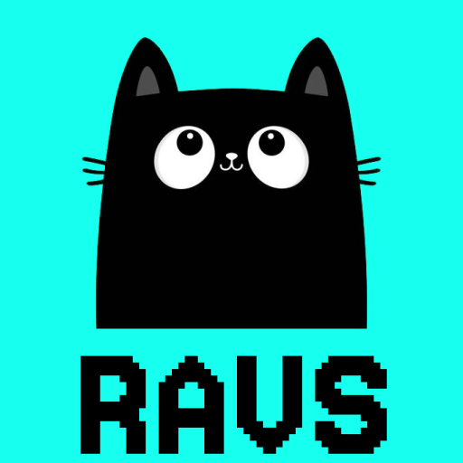

  

    <em>Ravs: Custom Programming Language & Compiler: A Journey into Interpreters and Compilers.</em>

## 💡 Inspiration
I am building a custom programming language and compiler as part of an exciting journey into understanding how interpreters and compilers work under the hood. The primary purpose of this project is to gain a deep, hands-on experience with the core principles of language design and the inner workings of the compilation process, all while having fun in the process of creating my own programming language.
This project involves designing a new language from scratch, implementing its syntax and semantics, and building a compiler that translates source code into executable instructions. By developing both the interpreter (for real-time execution) and the compiler (for converting code into machine-readable format), I aim to explore topics like lexical analysis, parsing, code generation, and optimisation, which are key to modern software development and language design.
Ultimately, the goal is not only to create a fully functional language and compiler but also to gain insights into the fundamental components that drive programming languages, compilers, and interpreters, while having a lot of fun building something unique and personal.